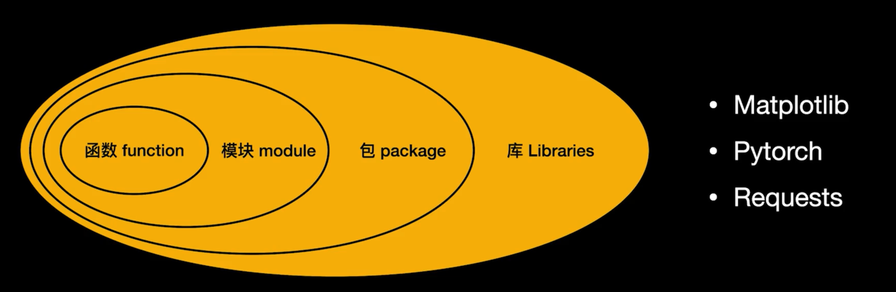

## 环境配置

### 下载 [miniconda](https://docs.conda.io/en/latest/miniconda.html)

### 常用命令

- 查看 conda 版本：`conda -V`
- 查看 conda 环境：`conda env list`
- 创建 conda 环境：`conda create --name demo_env python=3.9`
- 激活 conda 环境：`conda activate demo_env`

### 换国内源

1. **Windows及其他系统conda换源方法：** [点击链接](https://mirrors.tuna.tsinghua.edu.cn/help/anaconda/)

   Windows 用户无法直接创建名为 `.condarc` 的文件，可先执行 `conda config --set show_channel_urls yes` 生成该文件之后再修改。
   
   ```
   channels:
      - defaults
    show_channel_urls: true
    default_channels:
      - https://mirrors.tuna.tsinghua.edu.cn/anaconda/pkgs/main
      - https://mirrors.tuna.tsinghua.edu.cn/anaconda/pkgs/r
      - https://mirrors.tuna.tsinghua.edu.cn/anaconda/pkgs/msys2
    custom_channels:
      conda-forge: https://mirrors.tuna.tsinghua.edu.cn/anaconda/cloud
      msys2: https://mirrors.tuna.tsinghua.edu.cn/anaconda/cloud
      bioconda: https://mirrors.tuna.tsinghua.edu.cn/anaconda/cloud
      menpo: https://mirrors.tuna.tsinghua.edu.cn/anaconda/cloud
      pytorch: https://mirrors.tuna.tsinghua.edu.cn/anaconda/cloud
      pytorch-lts: https://mirrors.tuna.tsinghua.edu.cn/anaconda/cloud
      simpleitk: https://mirrors.tuna.tsinghua.edu.cn/anaconda/cloud
   ```

- `conda clean -i`
- `conda config --show-sources`

2. **Windows pip换源方法：**

   ==永久使用==

   - 第一步：在C:\Users\Administrator 目录下 创建pip文件夹
   - 第二步：在第一步创建的文件夹下(C:\Users\Administratorlpip) 创建pip.ini文件
   - 第三步：记事本编辑保存pip.ini文件内容为以下部分：

   ```
   [global]
   lindex-url = https://pypi.tuna.tsinghua.edu.cn/simple/
   [install]
   trusted-host = pypi.tuna.tsinghua.edu.cn
   ```

3. **Mac pip换源方法：**

   ==永久使用==

   * 修改 ~/.pip/pip.conf (没有就创建一个)， 内容如下：

   ```
   [global]
   index-url = https://pypi.tuna.tsinghua.edu.cn/simple
   ```

   ==临时使用==

​	可以在使用pip的时候在后面加上-i参数，指定pip源 
​	eg: `pip install numpy -i https://pypi.tuna.tsinghua.edu.cn/simple`


